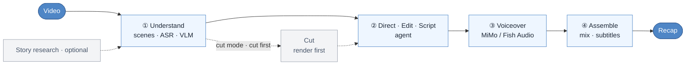

<!-- Last synced with README.md: 2026-09-20 -->

<p align="center">
  
</p>

<h1 align="center">Video Recap Skills</h1>

<p align="center">
  <b>Turn one or several videos into a Chinese-narration recap: six skills inside the coding agent you already use, ffmpeg locally, one Xiaomi MiMo key remotely, and an optional JianYing/CapCut draft to keep editing by hand.</b>
</p>

<p align="center">
  <a href="https://zenstory.ai/video-recap"><b>Project page</b></a>
  &nbsp;·&nbsp;
  <a href="#install"><b>Install</b></a>
  &nbsp;·&nbsp;
  <a href="#see-what-it-produces"><b>See what it produces</b></a>
  &nbsp;·&nbsp;
  <a href="README.md"><b>中文</b></a>
</p>

<p align="center">
  <a href="https://github.com/zenstory-ai/video-recap-skills/stargazers"></a>
  <a href="https://github.com/zenstory-ai/video-recap-skills/releases/latest"></a>
  
  <a href="https://www.python.org/"></a>
  <a href="https://github.com/zenstory-ai/video-recap-skills/actions/workflows/skill-validate.yml"></a>
  <a href="https://platform.xiaomimimo.com"></a>
  <a href="./LICENSE"></a>
</p>

<p align="center">
  <a href="https://github.com/zenstory-ai/video-recap-skills/issues"></a>
</p>

<video src="https://github.com/user-attachments/assets/f3c2df0c-6869-4f5b-8f4c-cce70b58b667" controls muted playsinline width="100%"></video>

The 59-second landscape recap above, *Guohuo (这一秒过火)*, is the final delivery after selecting from four episodes of a short drama, cutting, scripting, voicing, mixing, packaging, and several rounds of viewing feedback. Every creative artifact behind it (story plan, sound ownership, narration, timeline, QC reports, revision log, Remotion overlay source) lives in [examples/guohuo-60s/](examples/guohuo-60s/), and every excerpt below is copied from those files.

## What it is

Six skills install into Claude Code, Codex CLI, OpenCode, or OpenClaw. You give the video paths and the recap you want in plain language; the agent understands picture and dialogue, decides the story and audiovisual plan, cuts, writes, voices, mixes, and subtitles. Supported inputs: `.mp4 / .mov / .mkv / .webm`.

- **One key, ffmpeg locally.** ASR, VLM, and TTS all go through [Xiaomi MiMo](https://platform.xiaomimimo.com); the local runtime is Python's standard library plus `ffmpeg`, with no GPU, no `pip install`, and no model downloads. Voiceover can switch to Fish Audio, which replaces only that stage.
- **The editorial decision comes before the sound allocation.** The agent compares edit hypotheses first, writes the viewer promise, POV, dramatic question, and change-based beats into `recap_story_plan.json`, then assigns each beat a picture job and an audio owner: narration is voiced as a block only when it has a defined job, and strong dialogue, action sound, or silence may own an entire beat.
- **Cut first, narrate second, so the timeline is aligned by construction.** Cut mode renders the shortened video first and writes narration against that output timeline; feed several videos at once and pick ranges by `source_id` to cut one story spine; each video's analysis is saved to a filesystem material library for reuse.
- **Keep editing after the render.** The multi-track `timeline.json` exports to a JianYing draft with editable source clips, narration, BGM, subtitles, and image overlays; drop in an accurate subtitle file and it becomes the preferred source for original-dialogue captions.
- **Every step leaves a record you can check.** Narration lint, assembly QC, delivery QC, and the revision log are machine-readable files; the optional MiMo adviser only suggests, and a missing key, rate limit, or timeout never blocks the render.

## Install

Prerequisites: Python 3.10 or newer, `ffmpeg` with libass on `PATH` (subtitles are burned in by default), and one [Xiaomi MiMo](https://platform.xiaomimimo.com) API key.

```bash
brew install ffmpeg                        # macOS; apt on Debian/Ubuntu, choco / scoop / winget on Windows
export MIMO_API_KEY=your-mimo-key          # Windows PowerShell: $env:MIMO_API_KEY="your-mimo-key"
export MIMO_TOKEN_PLAN_CLUSTER=cn          # tp-* Token Plan keys only: cn | sgp | ams
```

MiMo needs no subscription; `sk-*` keys bill pay-as-you-go. One complete video measured for this project cost about CNY 1.3, varying with length and request volume.

Inside Claude Code:

```text
/plugin marketplace add zenstory-ai/video-recap-skills
/plugin install video-recap-skills@video-recap
```

Or just ask (any agent that can import a GitHub repository):

```text
Install this plugin: https://github.com/zenstory-ai/video-recap-skills
```

<details>
<summary><strong>Codex CLI, OpenCode, OpenClaw</strong></summary>

**Codex CLI**

```bash
codex plugin marketplace add zenstory-ai/video-recap-skills
codex plugin add video-recap-skills@video-recap
```

**OpenCode**: the [official Agent Skills documentation](https://opencode.ai/docs/skills/) puts project skills under `.opencode/skills/<name>/SKILL.md`. Clone the repository and start OpenCode from that directory:

```bash
git clone https://github.com/zenstory-ai/video-recap-skills.git
cd video-recap-skills
mkdir -p .opencode
ln -s ../skills .opencode/skills             # on Windows, copy skills\* into .opencode\skills\
opencode debug skill                         # should list all 6 skills
```

**OpenClaw**: after cloning, import the Claude plugin bundle:

```bash
openclaw plugins install ./video-recap-skills
openclaw skills list
```

Register the checkout through one discovery path only; duplicates cause name collisions or repeated triggers.

</details>

<details>
<summary><strong>Optional: voice with Fish Audio</strong></summary>

```bash
export TTS_PROVIDER=fish-audio
export FISH_API_KEY=your-fish-key
export FISH_TTS_REFERENCE_ID=your-voice-model-id  # optional; the built-in "娱乐扒妹" narration voice is the default
```

The default model is `s2.1-pro-free` with the built-in "娱乐扒妹" voice (reference ID `5653cea4ac83480aaf2bf45406556185`); billing follows Fish Audio's own terms. ASR and VLM still use MiMo, and local reference-voice cloning (`--voice-ref`) is available on the MiMo path only.

</details>

Once installed, ask the agent to check the environment:

```text
Check the video-recap environment and tell me whether Python, ffmpeg/libass, and MiMo are ready.
```

> Changes are in [CHANGELOG.md](CHANGELOG.md) and [Releases](https://github.com/zenstory-ai/video-recap-skills/releases). The repository moved from `worldwonderer/video-recap-skills` to `zenstory-ai/video-recap-skills`; if you installed from the old address, point at the new one.

## See what it produces

Every excerpt below is copied from a file in [examples/guohuo-60s/](examples/guohuo-60s/); cuts are marked with "…". The inputs were episodes 2, 3, 6, and 21 of *Guohuo*; the repository holds the structured artifacts only, never the episode audio or video. The files are in Chinese and are quoted as-is, with a translation after each.

### The story plan states the viewer promise first, then what changes in each beat

Before a single cut, the agent writes [`recap_story_plan.json`](examples/guohuo-60s/recap_story_plan.json). The director's intent answers four questions: what is promised, whose point of view, what question the audience watches with, and what is withheld until the end:

```json
"director_intent": {
  "viewer_promise": "60秒看懂死而复生的白月光为什么让男主一秒破防，并用三个名场面把关系推到婚服送嫁。",
  "pov": "跟随慕容清峄的认知与反应，让观众和他一起从震惊、发疯走到确认她仍会护他。",
  "dramatic_question": "她既然装作陌生人，为什么眼神、亲吻和保护都在暴露旧情？",
  "emotional_start": "荒诞吃瓜式震惊",
  "emotional_end": "抓马又上头的未完待续",
  "ending_aftertaste": "明明相爱却要嫁给哥哥的强悬念",
  "withhold_reveal": "前8秒先揭示准大嫂身份；中段以洗手台和护夫逐步证明旧情；最后才亮婚服。"
},
```

Translated: the promise is "in 60 seconds, understand why the lover who came back from the dead breaks the hero in one second, and push the relationship to the wedding-dress send-off through three iconic scenes"; the POV follows Murong Qingyi's realisation; the dramatic question is "if she is pretending to be a stranger, why do her eyes, the kiss, and her protecting him all betray the old love?"; the reveal order is "the sister-in-law identity in the first 8 seconds, the washstand and the shielding in the middle, the wedding dress last".

Each beat records not a scene summary but what changes, which question the audience carries in and out, the exact moment that must be kept, and where the evidence comes from (1 of 10 beats):

```json
{
  "beat_id": "b03",
  "source_id": "episode-03",
  "source_start": 1292.0,
  "source_end": 1305.5,
  "function": "escalation",
  "event": "男主堵住女主说出日日夜夜想她与挫骨扬灰",
  "change": "power: 女主回避→男主逼问",
  "audience_question_in": "男主会忍吗",
  "audience_question_out": "狠话里全是想念",
  "character_focus": "慕容清峄",
  "must_keep_moment": "完整原声“我日日夜夜地想你…挫骨扬灰”",
  "evidence": ["asr", "vlm", "hard_subtitle"]
},
```

Translated: the event is "he corners her and says he thinks of her day and night and wants to grind her bones to dust"; the change is "power: she evades → he interrogates"; the audience goes in asking "will he hold back?" and comes out with "every harsh word is longing"; the moment that must be kept is the complete original line, evidenced by ASR, VLM, and the burned-in subtitle.

In [`clip_plan.json`](examples/guohuo-60s/clip_plan.json) this beat becomes one range with a reason; cut mode renders the cut from it first and writes narration afterwards.

### Narration yields to original dialogue, and the owner of each beat is written down

[`visual_audio_board.json`](examples/guohuo-60s/visual_audio_board.json) assigns an `audio_owner` to every beat. The beat above is owned by the original dialogue, its narration job is `none`, and its playback speed is locked at 1.0 (1 of 10 beats):

```json
{
  "beat_id": "b03",
  "source_id": "episode-03",
  "source_start": 1292.0,
  "source_end": 1305.24,
  "output_start": 9.206666,
  "output_end": 22.446666,
  "picture_job": "performance",
  "preferred_moment": "完整原声“我日日夜夜地想你…挫骨扬灰”",
  "entry_reason": "尽量晚进到信息/动作将发生前",
  "exit_reason": "台词、动作或反应完整落地后立即离开",
  "audio_owner": "original_dialogue",
  "original_audio_anchor": "完整原声“我日日夜夜地想你…挫骨扬灰”",
  "narration_job": "none",
  "handoff": "旁白先补关系，原声/动作发生时完全让位；下一拍承接人物反应。",
  "playback_speed": 1.0
},
```

Translated: enter "as late as possible, just before the information or action lands"; exit "as soon as the line, action, or reaction has fully landed"; handoff "narration fills in the relationship first, then yields completely while the original sound or action plays; the next beat picks up the character's reaction".

So [`narration.json`](examples/guohuo-60s/narration.json) has only 7 narration blocks in the whole piece. The second stops at 10.2 s and the third does not enter until 23.047 s; the 13 seconds between belong entirely to that line:

```json
{
  "start": 5.773,
  "end": 10.2,
  "narration": "她改名方牧兰，嘴上装作不认识，一个眼神就把三年前的旧情全招了。",
  "pause_after_ms": 80,
  "overlaps_speech": true,
  "emotion": "调侃"
},
{
  "start": 23.047,
  "end": 26.5,
  "narration": "天呐，狠话还没落地，下一秒两个人直接亲上了。",
  "pause_after_ms": 50,
  "overlaps_speech": true,
  "emotion": "吃瓜、上头"
},
```

Translated: "She renamed herself Fang Mulan and pretends not to know him, but one look confesses the whole affair from three years ago." / "Oh no, the threat hasn't even landed and the next second they're kissing."

The three protected lines, proofread by the agent, go into [`original_subtitles.json`](examples/guohuo-60s/original_subtitles.json) and are burned as 「」 captions in the gaps:

```json
[
  { "start": 4.133, "end": 5.053, "text": "大嫂。" },
  { "start": 11.127, "end": 21.027, "text": "我好想你，日日夜夜地想你，想把你抽筋扒皮，挫骨扬灰。" },
  { "start": 35.673, "end": 37.473, "text": "有我在，你别怕。" }
]
```

Translated: "Sister-in-law." / "I missed you so much, day and night, I wanted to skin you alive and grind your bones to dust." / "I'm here. Don't be afraid."

At assembly, the original-audio track in [`timeline.json`](examples/guohuo-60s/timeline.json) is ducked under each narration block and restored after it; this timeline is what the JianYing export reads.

### After viewing: what changed, what was frozen, and how it was verified

The case went through four revision rounds, each written into [`revision-log.json`](examples/guohuo-60s/revision-log.json) as three lists: what to change, what stays frozen, how to verify. The last round unfreezes picture only:

```json
{
  "baseline": "final_picture_conform",
  "scope": "picture_conform",
  "change_set": [
    "remove the visible tail-frame pause near 42.08 seconds",
    "restore continuous source movement around 46.24 seconds"
  ],
  "frozen_set": [
    "story and narration",
    "all audio",
    "caption timing and typography",
    "title and accent graphics"
  ],
  "verification": [
    "normal-speed full watch",
    "join playback around both change points",
    "freeze detection as supporting evidence",
    "audio stream-copy verification",
    "full decode"
  ]
}
```

[`edit-map.json`](examples/guohuo-60s/edit-map.json) records how the jump near 46 s was repaired: not with a dissolve or a flash frame, but by restoring the 2001–2004 s stretch of the same continuous movement that had been cut out:

```json
{
  "name": "wedding_corridor_continuous_motion",
  "beat_ids": ["b07", "b08"],
  "output_frames": [1052, 1288],
  "output_seconds": [42.08, 51.52],
  "asset_id": "episode-21",
  "source_seconds": [1996.0, 2010.32],
  "speed": 1.516949153,
  "repair": "Restored the omitted 2001-2004 source interval instead of hiding the jump with a transition."
},
```

The mechanical pre-delivery checks are in [`assembly_qc.json`](examples/guohuo-60s/assembly_qc.json) (loudness, subtitle overflow, release gate) and [`delivery-qc.json`](examples/guohuo-60s/delivery-qc.json):

```json
"checks": {
  "full_decode": true,
  "audio_stream_matches_master": true,
  "vmaf_mean": 93.844938,
  "ssim_all": 0.989302,
  "psnr_average_db": 45.415972
}
```

And [`content-qc.md`](examples/guohuo-60s/content-qc.md) checks every narration claim against the footage and public sources, and states the interpretive boundary of each colloquial line (1 of 9 rows):

```markdown
| “这一下伪装露馅，男主全懂了” | 挡击动作和“有我在”原声连续证明她仍在意男主 | [爱奇艺官方角色片花](https://www.iqiyi.com/v_r8e40v8g54.html)确认二人重逢后身份错位、爱恨拉扯 | **解释成立，但需限定语义**：“全懂”指看懂她仍在意他，不指此刻才第一次认出她是任素素 |
```

Translated: claim "the disguise slips and the hero understands everything"; footage evidence: the shielding action and the "I'm here" line together prove she still cares; web evidence: iQIYI's official character trailer confirms the mistaken identity and push-pull after the reunion; verdict: **the interpretation holds, with a semantic limit**: "understands everything" means he sees she still cares, not that this is the first moment he recognises her as Ren Susu.

### Keep editing in JianYing

Add "export a JianYing draft" to the request and `timeline.json` is written as an editable multi-track draft: source clips, per-segment narration, BGM, subtitles, and image overlays each on their own track, with media bundled under `Resources/local` so the draft still opens on another machine. The `recap_<name>.mp4` that `ffmpeg` renders is the final piece; the draft is for you to keep working on.


Export contents and limits: [JianYing draft export and cost](docs/capcut-jianying-draft-export.md) (Chinese).

## Your first request

Copy one and adjust it. Give the video path, the recap you want, and any useful story context; you never run the repository's Python scripts by hand.

**Full-video recap:**

```text
Make a Chinese-narration recap of /path/to/video.mp4. It is episode 1 of 庆余年, the lead is 范闲, and subtitles should be burned in.
```

**Cut a long video or several episodes into one short recap:**

```text
Use /path/to/ep1.mp4 and /path/to/ep2.mp4 to make one ten-minute recap with a shared story spine, keeping key original dialogue and character reactions, not two separate summaries.
```

**Text-only handoff first, no voiceover and no render** (replace the 〈placeholders〉):

> I have permission to use 〈local video〉 and am supplying checked picture and dialogue records for it. Propose only the sound handoff for this material: which full dialogue line, action sound or pause to preserve, where narration is needed, and which record supports each choice. List missing evidence rather than inventing motives or unseen events. Return beat notes and necessary narration drafts without calling TTS or rendering.

The agent handles understanding, story and audiovisual planning, cutting, scripting, voiceover, and assembly. In cut mode it first chooses the footage, renders the shortened video, and only then writes narration on the output timeline; the internal pauses and resumes are the agent's job too.

## Workflow and the six skills



The six skills hand off through the JSON / MP4 artifacts in `work_dir`:

| Skill | Responsibility | In → Out |
|---|---|---|
| [`video-recap`](skills/video-recap/) | Orchestrator and environment doctor; the one to use for everyday end-to-end production | `video` → `recap_<name>.mp4` |
| [`video-understanding`](skills/video-understanding/) | Scene detection · frame extraction · ASR (`mimo-v2.5-asr`) · VLM (`mimo-v2.5`) · timeline fusion · creative brief | `video` → `scenes / asr_result / vlm_analysis / silence_periods / timeline_fusion / agent_narration_brief.md` |
| [`video-script`](skills/video-script/) | Directing / story / picture / sound plan, narration writing, advisory review and lint; call it alone for planning or writing only | `brief + index` → `recap_story_plan.json + visual_audio_board.json + [clip_plan.json] + narration.json` |
| [`video-cut`](skills/video-cut/) | Clip plan → rendered cut; cut first, narrate second on the output timeline | `clip_plan.json + video` → `edited_source.mp4` |
| [`video-voiceover`](skills/video-voiceover/) | Synthesise narration audio (MiMo `mimo-v2.5-tts` / Fish Audio `s2.1-pro-free`) | `narration.json` → `tts_segments/ + tts_meta.json` |
| [`video-assemble`](skills/video-assemble/) | Mix · duck original audio · render subtitles · multi-track timeline · optional JianYing export | `video + tts_meta` → `recap_<name>.mp4 + subtitles.srt/.ass + timeline.json` |

The recap is always written to `recap_<name>.mp4` alongside `subtitles.srt/.ass`; all intermediate artifacts live in `work_dir/`, with the field contracts in the [data schema](skills/video-recap/references/data-schema.md).

## Advanced requests

**Reuse previously analysed material:**

```text
Analyze /path/to/ep1.mp4 and save reusable understanding artifacts under /path/to/.video-materials. Prefer that material library in later projects.
```

The library holds JSON, Markdown, and an index only; it copies no media, builds no database, and uses no embeddings. The agent simply `grep`s the filesystem.

**Run an advisory MiMo review before and after assembly, and export a JianYing draft:**

```text
Make a recap of /path/to/video.mp4, run MiMo quality review before assembly and after rendering, and export an editable JianYing draft.
```

MiMo review makes at most one request per stage, only suggests, and never blocks the render if it fails.

**Align recap subtitles with the source's burned-in subtitle band:**

```text
Detect the source subtitle band in /path/to/video.mp4 and let me confirm the preview before rendering recap subtitles in the same region.
```

The preview is stored under `.subtitle_measure/`; it currently requires square-pixel video and bottom-aligned source subtitles.

**Voice with an authorised reference voice:**

```text
Use the voice from /path/to/voice-ref.wav for the recap of /path/to/video.mp4. I have the voice owner's authorization.
```

The reference audio is sent to MiMo for synthesis; use it only with the voice owner's authorisation.

**Dub an English video into Chinese while keeping the speaker's voice:**

```text
Dub /path/to/english.mp4 into Chinese, keeping the original speaker's voice.
```

This replaces the original speech rather than overlaying commentary; the current version supports one speaker and full-track replacement without background-music separation.

**Bring your own original-dialogue subtitles for accurate 「」 captions:** put `user_subtitles.json` (`[{"start": s, "end": s, "text": "line"}]` on the output timeline; wrap it as `{"timeline": "source", "lines": [...]}` for source-timeline subs mapped through the clip plan) or `user_subtitles.srt` / `.ass` (source timeline) into `work_dir`. Priority: your file › the agent-proofread `original_subtitles.json` › ASR fallback.

## FAQ

### My video has no narration, or even no dialogue. Can it still get a new narration track?

Yes. Understanding relies on the VLM reading the picture and does not require existing narration; when there is no dialogue either, have the agent skip ASR (`--skip-asr`) and narrate from the picture. This was asked in [issue #79](https://github.com/zenstory-ai/video-recap-skills/issues/79).

### A long video hit a 429 or was interrupted halfway. Do I start over?

No. VLM scene analysis resumes from where it stopped and recovers from rate limits; once `narration.json` is written, repeating the same command continues, cut mode records cut/narrate progress in `recap_phase.json`, and a resume only continues a work directory for the same source video and parameters.

### The VLM can't tell who is who and the narration is all "a man in black"?

When the title or plot is known, have the agent research first and write `background_research.json`; character names and relationships are folded into the VLM context. See the [research guide](skills/video-recap/references/research-guide.md) (Chinese).

## Further reading

- [Video-to-narration workflow](https://zenstory.ai/video-recap/video-to-narration) — establish picture, dialogue, and supplied background before treating a claim as a source-video fact
- [Original sound and narration](https://zenstory.ai/video-recap/original-audio-and-narration) — assign each beat's sound task first, then write the narration
- [JianYing / CapCut draft export](https://zenstory.ai/video-recap/capcut-draft) — export independently from a real `timeline.json`
- [JianYing draft export and cost](docs/capcut-jianying-draft-export.md) — in-repo document (Chinese): what is in the draft, and how self-hosting bills differ from SaaS
- [Guohuo case runbook](examples/guohuo-60s/skill-runbook.md) · [decision chain from content lock to final](examples/guohuo-60s/iteration-notes.md) (both in Chinese)
- Per-skill contracts in each `skills/<skill>/SKILL.md`; [data schema](skills/video-recap/references/data-schema.md) · [config playbook](skills/video-recap/references/config-playbook.md) · [multi-track timeline / JianYing export](skills/video-recap/references/timeline-and-jianying.md) · [creative editing playbook](skills/video-recap/references/creative-editing-playbook.md)

## Acknowledgements

- [LINUX DO - The New Ideal Community](https://linux.do) — community support
- The JianYing draft protocol references [pyJianYingDraft](https://github.com/GuanYixuan/pyJianYingDraft), [capcut-mate](https://github.com/Hommy-master/capcut-mate), and [duo-video](https://github.com/duoec/duo-video)
- Subtitle-band detection adapted from [ops120/video-recap-skills-plus](https://github.com/ops120/video-recap-skills-plus)

## License

MIT, see [LICENSE](LICENSE).

## Part of ZenStory AI

This project is maintained by [ZenStory AI](https://zenstory.ai) — open-source, agent-native tools for creating, adapting and producing stories (GitHub org: [zenstory-ai](https://github.com/zenstory-ai)). Sibling projects:

| Project | What it does |
| --- | --- |
| [oh-story-claudecode](https://github.com/zenstory-ai/oh-story-claudecode) | Web-fiction writing skill pack: chart scanning, deconstruction, drafting, de-AI-flavor, covers |
| [drama-skills](https://github.com/zenstory-ai/drama-skills) | AI short-drama / motion-comic suite: scripts, assets, storyboards, image & video prompts, review |
| [novel-to-game](https://github.com/zenstory-ai/novel-to-game) | Agent skills for source-grounded novel adaptation, target-runtime builds, and evidence-based QA |
| [video-recap-skills](https://github.com/zenstory-ai/video-recap-skills) | Create Chinese-narration recaps from supported video files, with optional editable JianYing/CapCut draft export (this repo) |
| [oh-story-dsh](https://github.com/zenstory-ai/oh-story-dsh) | Community DeepSeek Harness plugin with novel, short-drama, game and video-recap workbenches |
| [zenstory](https://github.com/zenstory-ai/zenstory) | Chat-to-create AI novel-writing workbench ([app.zenstory.ai](https://app.zenstory.ai)) |
