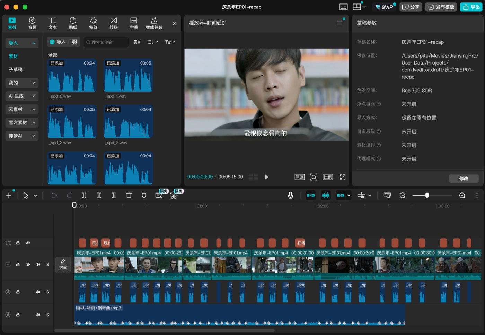
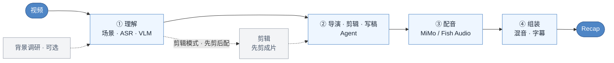

<p align="center">
  
</p>

<h1 align="center">Video Recap Skills</h1>

<p align="center">
  <b>把一段或几段视频做成中文解说成片：六个技能装进你正在用的编程 Agent，本地只要 ffmpeg，远程只要一个小米 MiMo key，成片还能一键导成剪映草稿接着改。</b>
</p>

<p align="center">
  <a href="https://zenstory.ai/zh/video-recap"><b>项目主页</b></a>
  &nbsp;·&nbsp;
  <a href="#安装"><b>安装</b></a>
  &nbsp;·&nbsp;
  <a href="#看看它的输出"><b>看看它的输出</b></a>
  &nbsp;·&nbsp;
  <a href="README.en.md"><b>English</b></a>
</p>

<p align="center">
  <a href="https://github.com/zenstory-ai/video-recap-skills/stargazers"></a>
  <a href="https://github.com/zenstory-ai/video-recap-skills/releases/latest"></a>
  
  <a href="https://www.python.org/"></a>
  <a href="https://github.com/zenstory-ai/video-recap-skills/actions/workflows/skill-validate.yml"></a>
  <a href="https://platform.xiaomimimo.com"></a>
  <a href="./LICENSE"></a>
</p>

<p align="center">
  <a href="https://github.com/zenstory-ai/video-recap-skills/issues"></a>
</p>

<video src="https://github.com/user-attachments/assets/f3c2df0c-6869-4f5b-8f4c-cce70b58b667" controls muted playsinline width="100%"></video>

上面这条 59 秒横屏解说《这一秒过火》，是从四集短剧里选段、剪辑、写稿、配音、混音、包装并经多轮看片修改后的最终交付；
它的全部创作产物（故事计划、声音分工、旁白、时间线、QC 报告、看片修改记录、Remotion 包装源码）都在
[examples/guohuo-60s/](examples/guohuo-60s/)，下文的节选全部来自这些文件。

## 这是什么

六个技能装进 Claude Code、Codex CLI、OpenCode 或 OpenClaw，你用自然语言给出视频路径和想要的成片，Agent 负责理解画面与对白、
决定故事与视听方案、剪辑、写稿、配音、混音和字幕。支持 `.mp4 / .mov / .mkv / .webm`。

- **一个 key，本地只要 ffmpeg。** ASR、VLM、TTS 都走[小米 MiMo](https://platform.xiaomimimo.com)，本地只用 Python 标准库和 `ffmpeg`，不需要 GPU，不需要 `pip install`，也不下载模型。配音可以换成 Fish Audio，只替换配音这一段。
- **先做创作决定，再分配声音。** Agent 先比较剪辑假设，把观众承诺、POV、戏剧问题和"发生了什么变化"的 beat 写进 `recap_story_plan.json`，再给每一拍指定画面任务和声音归属：旁白只在有明确任务时整块配音，强对白、动作声或沉默可以完整主导一拍。
- **先剪后配，时间轴天然对齐。** 剪辑模式先把长视频剪成成片，再对着成片写解说；一次可以传多个视频，按 `source_id` 选段剪成一条主线；每个视频的分析沉淀成文件系统素材库，下次直接复用。
- **成片之外还能继续改。** 多轨时间线 `timeline.json` 可一键导出剪映草稿，原片、解说、BGM、字幕、图片叠层都可编辑；自带一份准确字幕文件就会被当作原声字幕的首选来源。
- **每一步都留下可核对的记录。** 旁白 lint、组装 QC、交付 QC 和看片修改日志都是机器可读文件；可选的 MiMo 成片顾问只给建议，缺 key、限流或超时都不会阻断出片。

## 安装

前提：Python 3.10 或更新版本，`PATH` 上有带 libass 的 `ffmpeg`（默认烧录字幕），以及一个[小米 MiMo](https://platform.xiaomimimo.com) API Key。

```bash
brew install ffmpeg                        # macOS；Debian/Ubuntu 用 apt，Windows 用 choco / scoop / winget
export MIMO_API_KEY=your-mimo-key          # Windows PowerShell：$env:MIMO_API_KEY="your-mimo-key"
export MIMO_TOKEN_PLAN_CLUSTER=cn          # 仅 tp-* Token Plan key 需要：cn | sgp | ams
```

MiMo 不需要订阅，`sk-*` key 按量付费；本项目实测一条完整视频约 1.3 元，费用随视频时长和调用量变化。

在 Claude Code 里执行：

```text
/plugin marketplace add zenstory-ai/video-recap-skills
/plugin install video-recap-skills@video-recap
```

也可以直接说一句话（支持导入 GitHub 仓库的 Agent 都适用）：

```text
安装这个插件：https://github.com/zenstory-ai/video-recap-skills
```

<details>
<summary><strong>Codex CLI、OpenCode、OpenClaw</strong></summary>

**Codex CLI**

```bash
codex plugin marketplace add zenstory-ai/video-recap-skills
codex plugin add video-recap-skills@video-recap
```

**OpenCode**：按[官方 Agent Skills 文档](https://opencode.ai/docs/skills/)，项目级技能放在 `.opencode/skills/<name>/SKILL.md`。克隆仓库后从仓库目录启动：

```bash
git clone https://github.com/zenstory-ai/video-recap-skills.git
cd video-recap-skills
mkdir -p .opencode
ln -s ../skills .opencode/skills             # Windows 把 skills\* 复制到 .opencode\skills\
opencode debug skill                         # 应列出全部 6 个技能
```

**OpenClaw**：克隆后导入 Claude 插件包：

```bash
openclaw plugins install ./video-recap-skills
openclaw skills list
```

同一份技能只注册到一个发现目录，否则会重名或重复触发。

</details>

<details>
<summary><strong>可选：用 Fish Audio 配音</strong></summary>

```bash
export TTS_PROVIDER=fish-audio
export FISH_API_KEY=your-fish-key
export FISH_TTS_REFERENCE_ID=your-voice-model-id  # 可选；默认内置"娱乐扒妹"解说音色
```

默认模型 `s2.1-pro-free`，默认音色"娱乐扒妹"（reference ID `5653cea4ac83480aaf2bf45406556185`），计费以 Fish Audio 官方为准。ASR 和 VLM 仍走 MiMo；本地参考音频克隆（`--voice-ref`）只在 MiMo 路径可用。

</details>

装好后让 Agent 自检一次：

```text
检查 video-recap 的运行环境，告诉我 Python、ffmpeg/libass 和 MiMo 配置是否就绪。
```

> 变更见 [CHANGELOG.md](CHANGELOG.md) 与 [Releases](https://github.com/zenstory-ai/video-recap-skills/releases)。仓库已从 `worldwonderer/video-recap-skills` 迁到 `zenstory-ai/video-recap-skills`，按旧地址安装的用户请重新指向新仓库。

## 看看它的输出

下面每一段都摘自 [examples/guohuo-60s/](examples/guohuo-60s/) 里的真实文件，省略处用"…"标出。案例的输入是《这一秒过火》第 2、3、6、21 集，仓库只收录结构化产物，不含原剧音视频。

### 故事计划先写清"观众承诺"，再写每一拍的变化

Agent 在剪任何一刀之前先写 [`recap_story_plan.json`](examples/guohuo-60s/recap_story_plan.json)。导演意图是四个问题的答案：承诺什么、跟谁的视角、观众带着什么问题看、什么信息留到最后：

```json
"director_intent": {
  "viewer_promise": "60秒看懂死而复生的白月光为什么让男主一秒破防，并用三个名场面把关系推到婚服送嫁。",
  "pov": "跟随慕容清峄的认知与反应，让观众和他一起从震惊、发疯走到确认她仍会护他。",
  "dramatic_question": "她既然装作陌生人，为什么眼神、亲吻和保护都在暴露旧情？",
  "emotional_start": "荒诞吃瓜式震惊",
  "emotional_end": "抓马又上头的未完待续",
  "ending_aftertaste": "明明相爱却要嫁给哥哥的强悬念",
  "withhold_reveal": "前8秒先揭示准大嫂身份；中段以洗手台和护夫逐步证明旧情；最后才亮婚服。"
},
```

每个 beat 记的不是场景摘要，而是"发生了什么变化"、观众带着哪个问题进来、带着哪个问题出去，以及必须保住的具体时刻和证据来源（10 拍节选 1 拍）：

```json
{
  "beat_id": "b03",
  "source_id": "episode-03",
  "source_start": 1292.0,
  "source_end": 1305.5,
  "function": "escalation",
  "event": "男主堵住女主说出日日夜夜想她与挫骨扬灰",
  "change": "power: 女主回避→男主逼问",
  "audience_question_in": "男主会忍吗",
  "audience_question_out": "狠话里全是想念",
  "character_focus": "慕容清峄",
  "must_keep_moment": "完整原声“我日日夜夜地想你…挫骨扬灰”",
  "evidence": ["asr", "vlm", "hard_subtitle"]
},
```

这一拍在 [`clip_plan.json`](examples/guohuo-60s/clip_plan.json) 里变成一条带理由的选段，剪辑模式据此先剪出成片，再写旁白。

### 旁白让位给原声：谁主导这一拍是写在文件里的

[`visual_audio_board.json`](examples/guohuo-60s/visual_audio_board.json) 给每一拍指定 `audio_owner`。上面那一拍由原声主导，旁白任务是 `none`，播放速度锁定 1.0（10 拍节选 1 拍）：

```json
{
  "beat_id": "b03",
  "source_id": "episode-03",
  "source_start": 1292.0,
  "source_end": 1305.24,
  "output_start": 9.206666,
  "output_end": 22.446666,
  "picture_job": "performance",
  "preferred_moment": "完整原声“我日日夜夜地想你…挫骨扬灰”",
  "entry_reason": "尽量晚进到信息/动作将发生前",
  "exit_reason": "台词、动作或反应完整落地后立即离开",
  "audio_owner": "original_dialogue",
  "original_audio_anchor": "完整原声“我日日夜夜地想你…挫骨扬灰”",
  "narration_job": "none",
  "handoff": "旁白先补关系，原声/动作发生时完全让位；下一拍承接人物反应。",
  "playback_speed": 1.0
},
```

于是 [`narration.json`](examples/guohuo-60s/narration.json) 全片只有 7 个旁白块，第二块在 10.2 秒停下，第三块到 23.047 秒才进来，中间 13 秒完整留给那句原声：

```json
{
  "start": 5.773,
  "end": 10.2,
  "narration": "她改名方牧兰，嘴上装作不认识，一个眼神就把三年前的旧情全招了。",
  "pause_after_ms": 80,
  "overlaps_speech": true,
  "emotion": "调侃"
},
{
  "start": 23.047,
  "end": 26.5,
  "narration": "天呐，狠话还没落地，下一秒两个人直接亲上了。",
  "pause_after_ms": 50,
  "overlaps_speech": true,
  "emotion": "吃瓜、上头"
},
```

三段被保护的原声由 Agent 校对后写进 [`original_subtitles.json`](examples/guohuo-60s/original_subtitles.json)，在留白处烧成「」字幕：

```json
[
  { "start": 4.133, "end": 5.053, "text": "大嫂。" },
  { "start": 11.127, "end": 21.027, "text": "我好想你，日日夜夜地想你，想把你抽筋扒皮，挫骨扬灰。" },
  { "start": 35.673, "end": 37.473, "text": "有我在，你别怕。" }
]
```

组装时 [`timeline.json`](examples/guohuo-60s/timeline.json) 的原声轨在每个旁白块处自动压低、块后恢复；这份时间线就是剪映草稿导出的来源。

### 看片之后怎么改，改了什么、冻结了什么，都有账

案例经历了四轮修改，每轮在 [`revision-log.json`](examples/guohuo-60s/revision-log.json) 里写成三项：改什么、冻结什么、怎么验证。最后一轮只解冻画面：

```json
{
  "baseline": "final_picture_conform",
  "scope": "picture_conform",
  "change_set": [
    "remove the visible tail-frame pause near 42.08 seconds",
    "restore continuous source movement around 46.24 seconds"
  ],
  "frozen_set": [
    "story and narration",
    "all audio",
    "caption timing and typography",
    "title and accent graphics"
  ],
  "verification": [
    "normal-speed full watch",
    "join playback around both change points",
    "freeze detection as supporting evidence",
    "audio stream-copy verification",
    "full decode"
  ]
}
```

[`edit-map.json`](examples/guohuo-60s/edit-map.json) 记下 46 秒那处跳接是怎么修的：不是加溶解或闪白遮掩，而是把原片被删掉的 2001–2004 秒那段同一运动补回来：

```json
{
  "name": "wedding_corridor_continuous_motion",
  "beat_ids": ["b07", "b08"],
  "output_frames": [1052, 1288],
  "output_seconds": [42.08, 51.52],
  "asset_id": "episode-21",
  "source_seconds": [1996.0, 2010.32],
  "speed": 1.516949153,
  "repair": "Restored the omitted 2001-2004 source interval instead of hiding the jump with a transition."
},
```

交付前的机械检查写在 [`assembly_qc.json`](examples/guohuo-60s/assembly_qc.json)（响度、字幕溢出、发布门禁）和 [`delivery-qc.json`](examples/guohuo-60s/delivery-qc.json)：

```json
"checks": {
  "full_decode": true,
  "audio_stream_matches_master": true,
  "vmaf_mean": 93.844938,
  "ssim_all": 0.989302,
  "psnr_average_db": 45.415972
}
```

旁白里每一句话的事实依据则在 [`content-qc.md`](examples/guohuo-60s/content-qc.md) 逐条对照素材证据和公开资料，并把口语化表达的解释边界写明（9 行节选 1 行）：

```markdown
| “这一下伪装露馅，男主全懂了” | 挡击动作和“有我在”原声连续证明她仍在意男主 | [爱奇艺官方角色片花](https://www.iqiyi.com/v_r8e40v8g54.html)确认二人重逢后身份错位、爱恨拉扯 | **解释成立，但需限定语义**：“全懂”指看懂她仍在意他，不指此刻才第一次认出她是任素素 |
```

### 接着在剪映里改

加一句"导出剪映草稿"，`timeline.json` 就会写成可编辑的多轨草稿：原片、逐段解说、BGM、字幕和图片叠层各占一轨，素材默认打包进 `Resources/local`，草稿搬到别的机器仍能打开。`ffmpeg` 渲染的 `recap_<名>.mp4` 是最终成片，草稿是给你继续改的。



导出内容与边界见[剪映草稿导出与成本](docs/capcut-jianying-draft-export.md)。

## 安装后的第一条请求

复制、改一改就能用。直接给视频路径、期望成片和必要背景，不需要手动运行仓库里的 Python 脚本。

**完整视频解说：**

```text
给 /path/to/video.mp4 做一个中文解说成片。这是《庆余年》第一集，主角是范闲，字幕烧进画面。
```

**长视频或多集剪成一条短解说：**

```text
用 /path/to/ep1.mp4 和 /path/to/ep2.mp4 做一个十分钟解说，围绕同一条主线剪辑，保留关键原声和人物反应，不要分成两个小总结。
```

**先只做文本交接，不配音不渲染**（把〈占位内容〉换成自己的信息）：

> 我有权使用〈本地视频〉，并提供了对应的已核对画面与对白记录。先只给这段素材的声音分工建议：哪句对白、哪个动作声或停顿应完整保留，哪里确需旁白，依据是哪条记录。缺证据就列待核对项，不补人物动机或没出现的事件。交付分拍说明和必要的旁白草案，不调用配音或渲染。

Agent 会自动完成理解、故事与视听规划、剪辑、写稿、配音和合成。剪辑模式内部会先确定保留片段、生成剪后成片，再按输出时间轴写旁白；这些暂停和续跑也由 Agent 处理。

## 流程与六个技能



六个技能通过 `work_dir` 里的 JSON / MP4 产物衔接：

| 技能 | 职责 | 输入 → 输出 |
|---|---|---|
| [`video-recap`](skills/video-recap/) | 编排器与环境自检；日常端到端制作用它 | `视频` → `recap_<名>.mp4` |
| [`video-understanding`](skills/video-understanding/) | 场景检测 · 抽帧 · ASR（`mimo-v2.5-asr`）· VLM（`mimo-v2.5`）· 时间轴融合 · 生成创作 brief | `视频` → `scenes / asr_result / vlm_analysis / silence_periods / timeline_fusion / agent_narration_brief.md` |
| [`video-script`](skills/video-script/) | 导演 / 故事 / 画面 / 声音方案，解说写作，建议型评审与 lint；只做策划或写稿时单独调用 | `brief + 索引` → `recap_story_plan.json + visual_audio_board.json + [clip_plan.json] + narration.json` |
| [`video-cut`](skills/video-cut/) | 片段计划 → 拼剪成片；剪辑模式先剪后配，解说按成片时间轴写 | `clip_plan.json + 视频` → `edited_source.mp4` |
| [`video-voiceover`](skills/video-voiceover/) | 合成解说音频（MiMo `mimo-v2.5-tts` / Fish Audio `s2.1-pro-free`） | `narration.json` → `tts_segments/ + tts_meta.json` |
| [`video-assemble`](skills/video-assemble/) | 混音 · 压低原声 · 渲染字幕 · 多轨时间线 · 可选导出剪映 | `视频 + tts_meta` → `recap_<名>.mp4 + subtitles.srt/.ass + timeline.json` |

成片固定输出为 `recap_<名>.mp4`，同时产出 `subtitles.srt/.ass`；全部中间产物在 `work_dir/`，字段契约见[数据结构](skills/video-recap/references/data-schema.md)。

## 进阶请求

**复用已分析过的素材：**

```text
分析 /path/to/ep1.mp4，并把可复用的理解产物保存到 /path/to/.video-materials；后续制作时优先复用这个素材库。
```

素材库只保存 JSON / Markdown 和索引，不复制原始媒体、不建数据库、不做 embedding；Agent 直接在文件系统里 `grep`。

**合成前后各做一次 MiMo 质量复核，并导出剪映草稿：**

```text
给 /path/to/video.mp4 做解说，合成前和成片后都做 MiMo 质量复核，并导出可继续编辑的剪映草稿。
```

MiMo 复核每个阶段最多一次请求，只给建议，失败也不阻断出片。

**让解说字幕贴合原片硬字幕的位置：**

```text
先检测 /path/to/video.mp4 的原片字幕区域并让我确认预览，再把解说字幕贴到同一区域生成成片。
```

检测预览保存在 `.subtitle_measure/`；当前要求方形像素视频和底部对齐字幕。

**用有授权的参考音色配音：**

```text
用 /path/to/voice-ref.wav 的音色给 /path/to/video.mp4 做解说；我已获得音色所有者授权。
```

参考音频会发送给 MiMo 用于合成，只在获得音色所有者授权时使用。

**英语视频译成中文并保留原说话人的声音：**

```text
把 /path/to/english.mp4 翻译成中文配音，保留原说话人的声音。
```

这是替换原始台词而不是叠加解说；当前支持单说话人整轨替换，不分离背景音乐。

**自带原声字幕，让留白处的「」字幕更准：** 把 `user_subtitles.json`（`[{"start": 秒, "end": 秒, "text": "台词"}]`，按成片时间轴；包一层 `{"timeline": "source", "lines": [...]}` 则按原片时间轴自动映射）或 `user_subtitles.srt` / `.ass`（按原片时间轴）放进 `work_dir`。优先级：你的字幕文件 › Agent 校对的 `original_subtitles.json` › ASR 兜底。

## 常见问题

### 视频本来没有旁白、甚至没有对白，能给它加上新旁白吗？

可以。理解阶段靠 VLM 看画面，不要求原视频有旁白；素材连对白也没有时，让 Agent 跳过 ASR（`--skip-asr`），按画面生成解说。这是 [issue #79](https://github.com/zenstory-ai/video-recap-skills/issues/79) 问过的问题。

### 长视频跑到一半报 429 或中断了，要从头再来吗？

不用。VLM 场景分析可断点续传，限流会自愈；写好 `narration.json` 后重复同一条命令即可继续，剪辑模式的剪 / 配进度记录在 `recap_phase.json`，续跑只会接同一个源视频、同一组参数的工作目录。

### VLM 认不出谁是谁，解说里全是"黑衣男子"？

片名或剧情明确时，先让 Agent 做背景调研写进 `background_research.json`，人物名和关系会折入 VLM 上下文；见[背景调研指南](skills/video-recap/references/research-guide.md)。

## 延伸阅读

- [视频到解说完整流程](https://zenstory.ai/zh/video-recap/video-to-narration) — 先确认画面、对白与已提供背景，不把猜测写成片中事实
- [原声与旁白分工](https://zenstory.ai/zh/video-recap/original-audio-and-narration) — 先定每拍声音任务，再写解说词
- [剪映 / CapCut 草稿导出](https://zenstory.ai/zh/video-recap/capcut-draft) — 用真实 `timeline.json` 独立导出
- [剪映草稿导出与成本](docs/capcut-jianying-draft-export.md) — 仓库内文档：草稿里有什么、自建与 SaaS 的账单差别
- [能力边界与验收原则](docs/production-boundaries.md) — 仓库内文档：哪些交付规则进通用库、哪些属于单个项目；三类验收不能互相冒充
- [《这一秒过火》案例复现 runbook](examples/guohuo-60s/skill-runbook.md) · [从内容锁定到最终版的决策链](examples/guohuo-60s/iteration-notes.md)
- 各技能契约：每个 `skills/<skill>/SKILL.md`；[数据结构](skills/video-recap/references/data-schema.md) · [配置手册](skills/video-recap/references/config-playbook.md) · [多轨时间线 / 剪映导出](docs/timeline-and-jianying.md) · [创作剪辑手册](skills/video-recap/references/creative-editing-playbook.md)

## 致谢

- [LINUX DO - The New Ideal Community](https://linux.do) — 社区支持
- 剪映草稿协议参考 [pyJianYingDraft](https://github.com/GuanYixuan/pyJianYingDraft)、[capcut-mate](https://github.com/Hommy-master/capcut-mate) 和 [duo-video](https://github.com/duoec/duo-video)
- 字幕带检测适配自 [ops120/video-recap-skills-plus](https://github.com/ops120/video-recap-skills-plus)

## 许可

MIT，见 [LICENSE](LICENSE)。

## ZenStory AI 项目

本项目由 [ZenStory AI](https://zenstory.ai/zh) 维护——一组开源、面向 agent 的故事创作、改编与生产工具（GitHub 组织：[zenstory-ai](https://github.com/zenstory-ai)）。同组织项目：

| 项目 | 用途 |
| --- | --- |
| [oh-story-claudecode](https://github.com/zenstory-ai/oh-story-claudecode) | 网文写作 skill 包：扫榜、拆文、写作、去AI味、封面图 |
| [drama-skills](https://github.com/zenstory-ai/drama-skills) | AI 短剧 / 漫剧创作 skill 合集：剧本、资产、分镜、图片/视频提示词、独立审查 |
| [novel-to-game](https://github.com/zenstory-ai/novel-to-game) | 面向原著改编、指定运行环境构建与运行证据 QA 的 agent skills |
| [video-recap-skills](https://github.com/zenstory-ai/video-recap-skills) | 将支持的视频文件制作成中文解说，可选导出可编辑的剪映/CapCut 草稿（本仓库） |
| [oh-story-dsh](https://github.com/zenstory-ai/oh-story-dsh) | DeepSeek Harness 社区插件，提供小说、短剧、游戏和视频解说工作台 |
| [zenstory](https://github.com/zenstory-ai/zenstory) | 对话即创作的 AI 小说写作工作台（[app.zenstory.ai](https://app.zenstory.ai)） |
